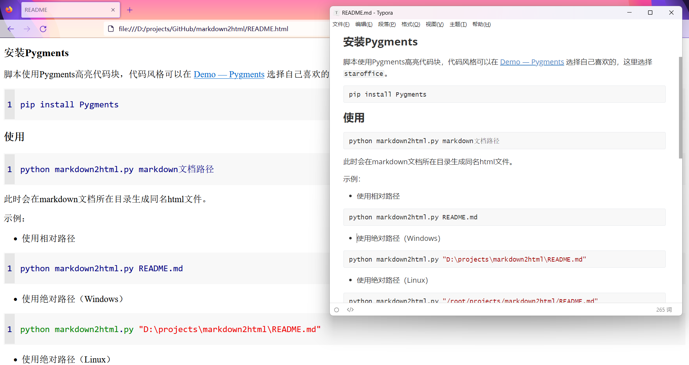

### 前言

由于毕设需要一个将markdown文档转为html代码的功能，起初使用Python的markdown模块，但转换之后的结果和我想要的不是很一致，也可能是因为我markdown文档内容的缘故。所以决定写一个脚本，满足我的毕设的使用请求，功能自然无法和markdown模块相媲美。

### 安装Pygments

脚本使用Pygments高亮代码块，代码风格可以在 [Demo — Pygments](https://pygments.org/demo/) 选择自己喜欢的，这里选择`staroffice`。

```shell
pip install Pygments
```

### 使用

```shell
python markdown2html.py markdown文档路径
```

此时会在markdown文档所在目录生成同名html文件。

示例：

+ 使用相对路径

```shell
python markdown2html.py README.md
```

+ 使用绝对路径（Windows）

```powershell
python markdown2html.py "D:\projects\markdown2html\README.md"
```

+ 使用绝对路径（Linux）

```shell
python markdown2html.py "/root/projects/markdown2html/README.md"
```

### 运行结果



### 目前支持的功能

+ 代码块

+ 无序列表（目前仅支持转换后为单个li标签）

+ 水平分割线

+ 图片

+ 删除线

+ 加粗/强调

+ 超链接

+ 代码

